# MINIKUBE HELM CHARTS

Este ejemplo implementa un clúster Elasticsearch 8.0.0-SNAPSHOT de 3 nodos en Minikube utilizando valores personalizados.

## CONSIDERACIONES

Este instructivo se desarrolla en Sistema Operativo Ubuntu 20.04.

---

ESte instructivo se realizo siguiendo los pasos del tutorial: [Tutorial](https://logz.io/blog/deploying-the-elk-stack-on-kubernetes-with-helm/)

## PRECONDICIONES

1. Instalar Docker [Docker Install](https://www.digitalocean.com/community/tutorials/how-to-install-and-use-docker-on-ubuntu-20-04-es)

2. Instalar Kubectl [Kubectl Install](https://kubernetes.io/es/docs/tasks/tools/install-kubectl/)

3. Instalar Minikube [Minikube Install](https://phoenixnap.com/kb/install-minikube-on-ubuntu)

4. Instalar Helm Chart [Helm Install](https://helm.sh/docs/intro/install/)

## PASOS A SEGUIR

### Configurar Kubernetes para el Stack ELK

1. Inicializar Minikube

> minikube start --cpus 4 --memory 8192

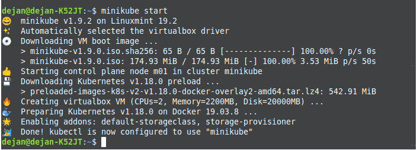

> kubectl cluster-info

2. Crear Namespace Elastic

> kubectl create ns elastic

3. Habilitar los complmentos de volumenes persistentes denominados default-storageclass y storage-provisioner

> minikube addons enable default-storageclass
> minikube addons enable storage-provisioner

### Implementar un Cluster de Elasticsearch con Helm

1. Agregamos el repositorio de Elastic al repositorio de paquetes de Helm

> helm repo add elastic https://helm.elastic.co
---

Helm ElasticSearch [Repositorio](https://artifacthub.io/packages/helm/elastic/elasticsearch)

---
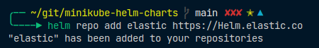

2. Obtenemos la configuracion por defecto

> curl -O https://raw.githubusercontent.com/elastic/Helm-charts/master/elasticsearch/examples/minikube/values.yaml

3. Instalamos ElasticSearch con los valores predeterminados

> helm install elasticsearch --namespace=elastic elastic/elasticsearch -f ./values.yaml

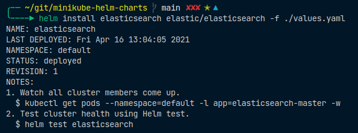

4. Validamos la ejecucion del cluster de 3 nodos

> kubectl get pods -n=elastic -l app=elasticsearch-master -w

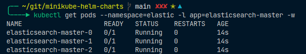

---

"Para eliminar un cluster: "
> helm del elasticsearch --namespace=elastic

---

5. Nuestro último paso para implementar Elasticsearch es configurar el reenvío de puertos:

> kubectl -n elastic port-forward svc/elasticsearch-master 9200

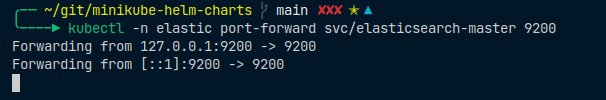

6. Probar la disponibilidad del servicio

> curl localhost:9200/_cat/indices

### Implementar Kubana con Helm

1. Instalamos Kibana con los valores predeterminados

> helm install kibana --namespace=elastic elastic/kibana

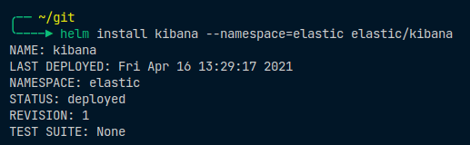

2. Validamos la ejecucion del cluster de 3 nodos

> kubectl get pods -n=elastic -l app=kibana

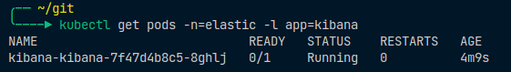

3. Nuestro último paso para implementar Kibana es configurar el reenvío de puertos:

> kubectl -n elastic port-forward deployment/kibana-kibana 5601

4. Ya con esto tendremos desplegado Kibana accediendo a:

> <http://localhost:5601>

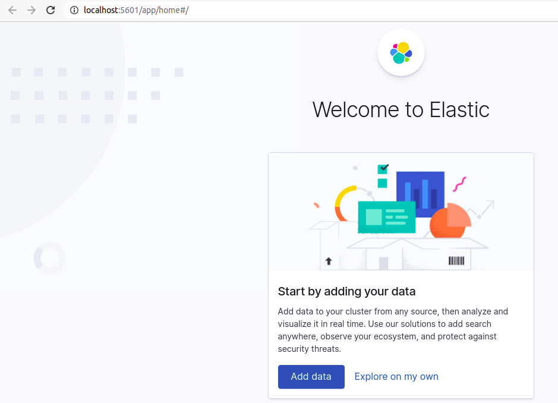

### Eliminar todos los recursos de un namespace

> kubectl delete all --all -n {namespace}

### Implementar Metricbeat con Helm

1. Instalamos Kibana con los valores predeterminados

> helm install metricbeat --namespace=elastic elastic/metricbeat

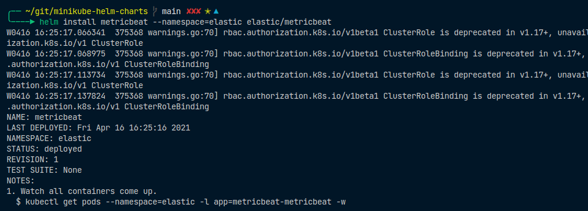

2. Validamos la creacion del Pod de Metricbeat

> kubectl get pods -n=elastic -l app=metricbeat-metricbeat

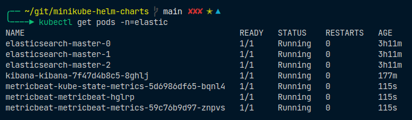

3. Observamos que las metricas de Beat ya han comenzado a indexarse en ElasticSearch

> curl localhost:9200/_cat/indices

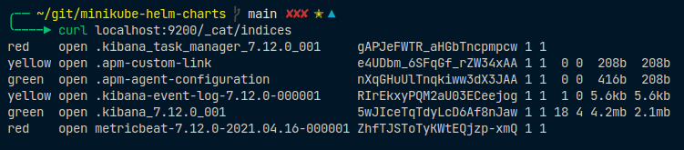

4. Ahora lo que falta es definir el patron de indice en Kibana y comenzar a analizar los datos. En Kibana vamos a la pagina de **Administracion -> Kibana --> Patrones Indice** y hacemos **Crear patron de Indice**. Con esto Kibana identificara y mostrara automaticamente el indice Metricbeat.

Ingresamos metricbeat-metricbeat-* 

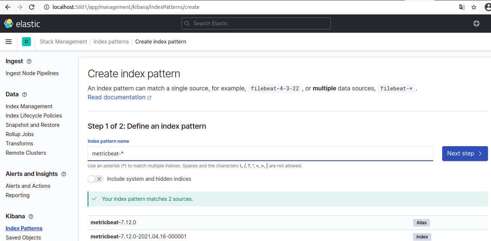

En el paso siguiente *Create index pattern*

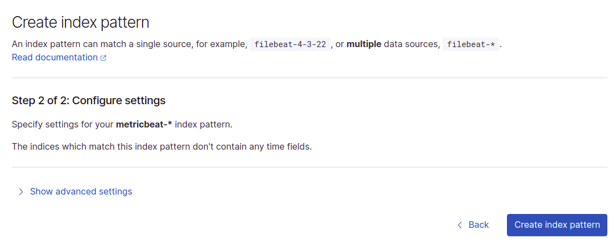

