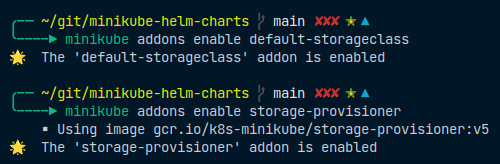
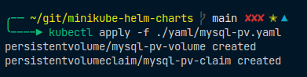
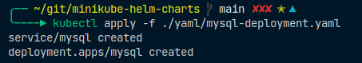
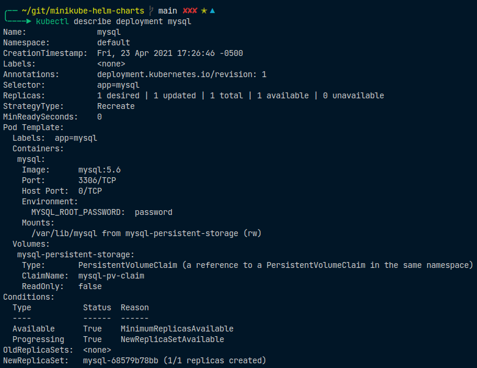
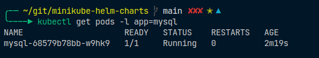
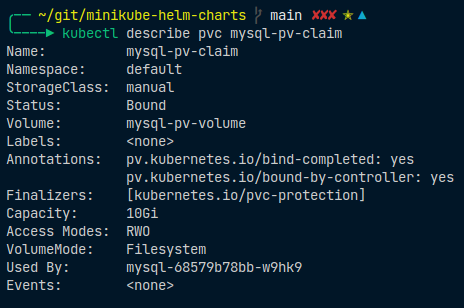
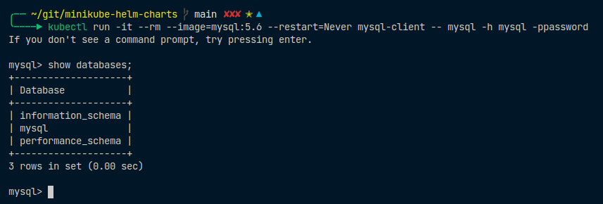

# MINIKUBE HELM CHARTS

Este ejemplo implementa un clúster Elasticsearch 8.0.0-SNAPSHOT de 3 nodos en Minikube utilizando valores personalizados. Ademas de desplegara una instancia del servidor de Base de Datos Mysql de nodo unico.

## CONSIDERACIONES

Este instructivo se desarrolla en Sistema Operativo Ubuntu 20.04.

---

ESte instructivo se realizo siguiendo los pasos del tutorial: [Tutorial](https://logz.io/blog/deploying-the-elk-stack-on-kubernetes-with-helm/)

## PRECONDICIONES

1. Instalar Docker [Docker Install](https://www.digitalocean.com/community/tutorials/how-to-install-and-use-docker-on-ubuntu-20-04-es)

2. Instalar Kubectl [Kubectl Install](https://kubernetes.io/es/docs/tasks/tools/install-kubectl/)

3. Instalar Minikube [Minikube Install](https://phoenixnap.com/kb/install-minikube-on-ubuntu)

4. Instalar Helm Chart [Helm Install](https://helm.sh/docs/intro/install/)

## PASOS A SEGUIR

### Configurar Kubernetes para el Stack ELK

1. Inicializar Minikube

> minikube start --cpus 4 --memory 8192

> kubectl cluster-info

2. Crear Namespace Elastic

> kubectl create ns elastic

3. Habilitar los complmentos de volumenes persistentes denominados default-storageclass y storage-provisioner

> minikube addons enable default-storageclass
> minikube addons enable storage-provisioner

### Implementar un Cluster de Elasticsearch con Helm

1. Agregamos el repositorio de Elastic al repositorio de paquetes de Helm

> helm repo add elastic https://helm.elastic.co
---

Helm ElasticSearch [Repositorio](https://artifacthub.io/packages/helm/elastic/elasticsearch)

---

2. Obtenemos la configuracion por defecto

> curl -O https://raw.githubusercontent.com/elastic/Helm-charts/master/elasticsearch/examples/minikube/values.yaml

3. Instalamos ElasticSearch con los valores predeterminados

> helm install elasticsearch --namespace=elastic elastic/elasticsearch -f ./values.yaml

4. Validamos la ejecucion del cluster de 3 nodos

> kubectl get pods -n=elastic -l app=elasticsearch-master -w

---

"Para eliminar un cluster: "
> helm del elasticsearch --namespace=elastic

---

5. Nuestro último paso para implementar Elasticsearch es configurar el reenvío de puertos:

> kubectl -n elastic port-forward svc/elasticsearch-master 9200

6. Probar la disponibilidad del servicio

> curl localhost:9200/_cat/indices

### Implementar Kubana con Helm

1. Instalamos Kibana con los valores predeterminados

> helm install kibana --namespace=elastic elastic/kibana

2. Validamos la ejecucion del cluster de 3 nodos

> kubectl get pods -n=elastic -l app=kibana

3. Nuestro último paso para implementar Kibana es configurar el reenvío de puertos:

> kubectl -n elastic port-forward deployment/kibana-kibana 5601

4. Ya con esto tendremos desplegado Kibana accediendo a:

> <http://localhost:5601>

### Eliminar todos los recursos de un namespace

> kubectl delete all --all -n {namespace}

### Implementar Metricbeat con Helm

1. Instalamos Kibana con los valores predeterminados

> helm install metricbeat --namespace=elastic elastic/metricbeat

2. Validamos la creacion del Pod de Metricbeat

> kubectl get pods -n=elastic -l app=metricbeat-metricbeat

3. Observamos que las metricas de Beat ya han comenzado a indexarse en ElasticSearch

> curl localhost:9200/_cat/indices

4. Ahora lo que falta es definir el patron de indice en Kibana y comenzar a analizar los datos. En Kibana vamos a la pagina de **Administracion -> Kibana --> Patrones Indice** y hacemos **Crear patron de Indice**. Con esto Kibana identificara y mostrara automaticamente el indice Metricbeat.

Ingresamos metricbeat-metricbeat-* 

En el paso siguiente *Create index pattern*

# DESPLIEGUE DE INSTANCIA MYSQL DE NODO UNICO

este apartado contiene los pasos para el despliegue de una instancia de nodo unico del servidor de Base de Datos Mysql de Nodo Unico. Sin embargo se puede implementar Mysql en modo cluster con replicacion de nodos haciendo uso de Helm. Para mayor detalle de este tipo de implementacion se puede referenciar el siguiente repositorio: [Tutorial](https://github.com/bitnami/charts/tree/master/bitnami/mysql/#installing-the-chart)

## Objetivos

1. Crear un Volumen Persistente con una asignacion de disco y su referencia.
2. Desplegar una implementacion de Mysql
3. Exponer Mysql a otros pods del cluster con un nombre DNS conocido

## Precondiciones

1. Debe tener un aprovisionador PersistentVolume dinámico con una StorageClass predeterminada

> minikube addons enable default-storageclass
> minikube addons enable storage-provisioner
 
## Pasos a seguir

1. Crear el Volumen persistente el cual alojara los datos persistentes del motor de Base de Datos. Con esto se asegura que asi se destruya el Pod al tener asociado un Volumen Persistente cuando se haga un nueva creacion de un Pod que apunte a este Volumen se recupera la informacion previamente almacenada. Por ejemplo Bases de Datos.

>> kubectl apply -f ./yaml/mysql-pv.yaml

2. Desplegamos Mysql como servicio. Validar la configuracion dada en mysql-deployment.yaml

>> kubectl apply -f ./yaml/mysql-deployment.yaml

3. Mostramos informacion sobre la implementacion

>> kubectl describe deployment mysql

4. Enumeramos los Pods creados para la implementacion. Como se observa en la imagen tenemos un Pod en Ejecucion.

>> kubectl get pods -l app=mysql

6. Inspecciones informacion de la configuracion del Volumen Persistente

>> kubectl describe pvc mysql-pv-claim

7. Accediendo a la instancia de Mysql

El archivo YAML anterior crea un servicio que permite que otros pods del clúster accedan a la base de datos. La opción Servicio clusterIP: Nonepermite que el nombre DNS del servicio se resuelva directamente en la dirección IP del Pod. Esto es óptimo cuando solo tiene un Pod detrás de un Servicio y no tiene la intención de aumentar la cantidad de Pods.

Ejecute un cliente MySQL para conectarse al servidor:

>> kubectl run -it --rm --image=mysql:5.6 --restart=Never mysql-client -- mysql -h mysql -ppassword

Este comando crea un nuevo Pod en el clúster que ejecuta un cliente MySQL y lo conecta al servidor a través del Servicio. Si se conecta, sabrá que su base de datos MySQL con estado está en funcionamiento.

## ELIMINAR LA IMPLEMENTACION

Procedemos a eliminar los objetos creados.

>> kubectl delete deployment,svc mysql
>> kubectl delete pvc mysql-pv-claim
>> kubectl delete pv mysql-pv-volume
